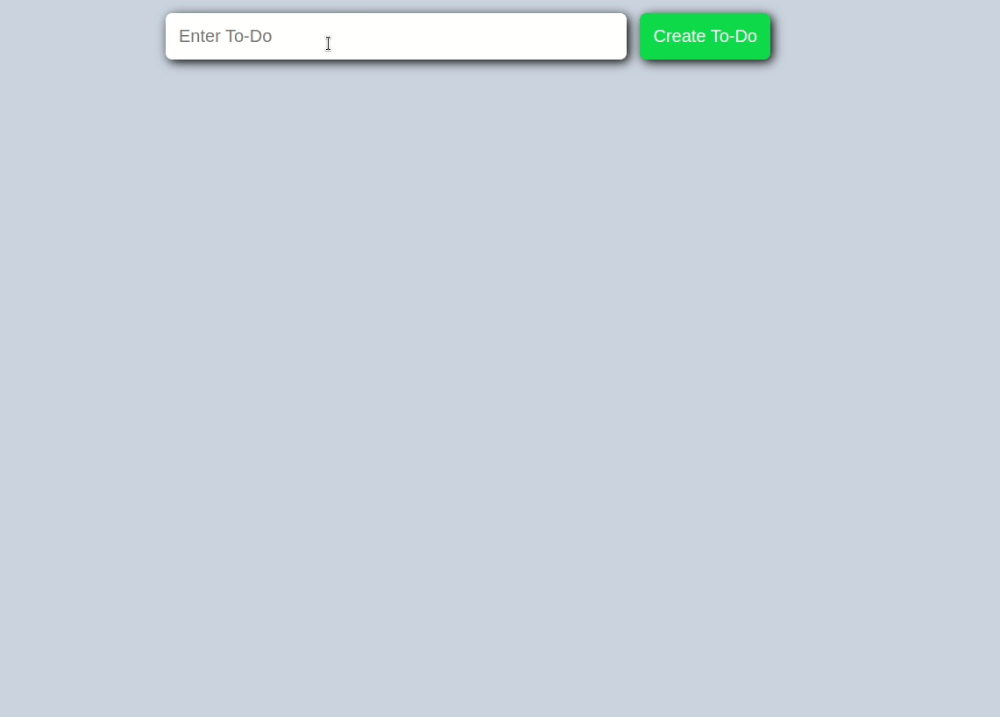

# To-Do List App

### Description:

- Through this To-Do List App, the user should be able to add items to the todo list.
- There's an `input` field where the items are added.
- The user can also delete these items through a `button`.

1. Create a TO-DO List app with an `input` field and a `button` reading **"Create Task"** for adding To-Do's. If you click on the `button`, a To-Do should be added to the list of To-Do's.

2. Add a _Delete_ `button` to each item, to enable the user delete a To-Do from the list.

3. **Optional:** Style to your pleasing.

## Bonus

- Add a `button` to show that the item is complete or done.
- You can add styling to cross-out an item.

> Hint: Refer to the representation below, for an idea of what your result should look like.
> 

[//]: # (autograding info start)
#  Results
> ⌛ Give it a minute. As long as you see the orange dot  on top, CodeBuddy is still processing. Refresh this page to see it's current status.
>
> This is what CodeBuddy found when running your code. It is to show you what you have achieved and to give you hints on how to complete the exercise.

### Add ToDos

|                 Status                  | Check                                                                                    |
| :-------------------------------------: | :--------------------------------------------------------------------------------------- |
|  | Page should contain task input field |
|  | Page should contain 'Create Task' button |
|  | Task is created when entering text into input field and clicking button |

### Delete ToDos

|                 Status                  | Check                                                                                    |
| :-------------------------------------: | :--------------------------------------------------------------------------------------- |
|  | Items should have 'x' delete button |
|  | Items is removed when clicking 'x' button |

[🔬 Results Details](../../actions)
[🐞 Tips on Debugging](https://github.com/DCI-EdTech/autograding-setup/wiki/How-to-work-with-CodeBuddy)
[📢 Report Problem](https://docs.google.com/forms/d/e/1FAIpQLSfS8wPh6bCMTLF2wmjiE5_UhPiOEnubEwwPLN_M8zTCjx5qbg/viewform?usp=pp_url&entry.652569746=Browser-ToDoList)

[//]: # (autograding info end)